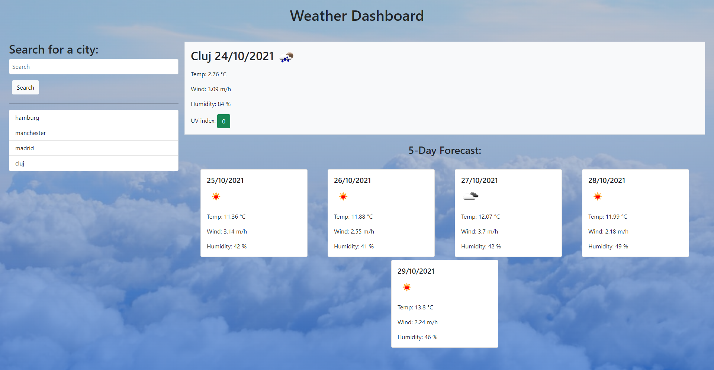
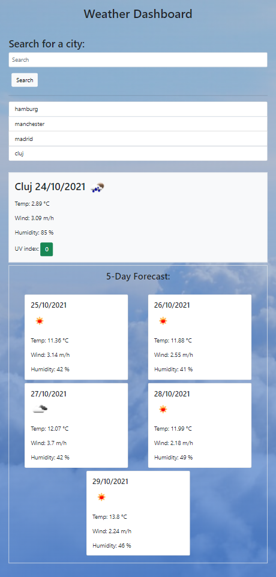
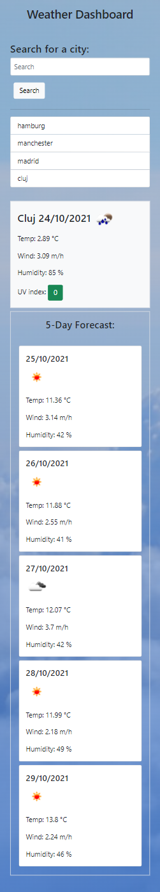

# Weather Dashboard

An app designed to provide user's with weekly weather information based on city search criteria.

## Link deployed application

Click [here](https://lianavaleria15.github.io/weather-dashboard/) to view the deployed application.

## Description

For this job ticket I created a fully responsive weather dashboard. When user lands on the page, they are presented with a search bar to insert a city. When the search is generated, the city name is added in a city list at the bottom of the search bar.

At the same time, a series of cards are rendered on the page including current date weather data and 5-days forecast data.

To access the data, I used the Open Weather APIs for current and 8-days weather. In terms of information presented, from the API I pulled data containing (city, unix timestamp date, temperature, wind, speed, humidity and UVI index). As the 8-day API would retrieve data for 8 days, used a `slice` method function on the data array, to the next 5 days data.

Each city search has been added to the local storage and retrieved when user lands on the page: `onLoad` function and `on("click")` function, when user clicks a city already present in the city list search.

## To improve

Despite getting the weather data, rendering the cards and store to local storage, this application is still a work in progress. In the future I am planning to improve the user experience by replacing the existent weather cards from previous search with a warning modal that the search doesn't exist in the data.

I also plan to control the storage of information that does not include a city to local storage and add clear button on each city list item to clear the search.

There is work to do in terms of design experience as well, as the white cards on the image background are a bit disturbing to the eye.

## User Story

```
AS A traveler
I WANT to see the weather outlook for multiple cities
SO THAT I can plan a trip accordingly
WHEN I search for a city
THEN I am presented with current and future conditions for that city and that city is added to the search history
WHEN I view current weather conditions for that city
THEN I am presented with the city name, the date, an icon representation of weather conditions, the temperature, the humidity, the wind speed, and the UV index
WHEN I view the UV index
THEN I am presented with a color that indicates whether the conditions are favorable, moderate, or severe
WHEN I view future weather conditions for that city
THEN I am presented with a 5-day forecast that displays the date, an icon representation of weather conditions, the temperature, the wind speed, and the humidity
WHEN I click on a city in the search history
THEN I am again presented with current and future conditions for that city

```

## Technology Used

### HTML5

- created header and main weather container, including search bar

### CSS3

- added custom css for hero image

### BOOTSTRAP

- used Bootstrap library to design the current and forecast weather cards, together with recently searched city list.
- added responsiveness for different viewport sizes

### JQUERY

- used for DOM manipulation (target parent containers)
- functionality on event listeners and event target

### JAVASCRIPT

- added functionality: API request, construct and render weather containers
- add and retrieve city name from local storage

### MOMENT.JS

- transformed unix data to moment js and formatted to `DD/MM/AAAA`

## API Documentation

Weather information data was imported using OpenWeather API service.

### URLs

#### First API call - to get city name and latitude and longitude parameters

`https://api.openweathermap.org/data/2.5/weather?q=${cityName}&appid=${keyAPI}`

#### Second API call - to get current and forecast weather data

`https://api.openweathermap.org/data/2.5/onecall?lat=${lat}&lon=${lon}&appid=${keyAPI}&units=metric`

### Method

`GET` request

## Screenshots

### Desktop viewport



### Tablet viewport



### Mobile viewport


